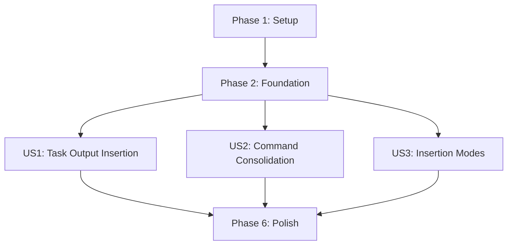

# Tasks: Task Output Insertion and Command Consolidation

**Input**: Design documents from `/specs/003-task-output-insertion/`
**Prerequisites**: plan.md (required), spec.md (required for user stories), research.md, data-model.md, contracts/

**Tests**: Tests are included following test-first development principles per constitution requirements.

**Organization**: Tasks are grouped by user story to enable independent implementation and testing of each story.

## Format: `[ID] [P?] [Story] Description`

- **[P]**: Can run in parallel (different files, no dependencies)
- **[Story]**: Which user story this task belongs to (e.g., US1, US2, US3)
- Include exact file paths in descriptions

## Path Conventions

VS Code Extension structure with paths at repository root:
- `src/` - TypeScript source code
- `tests/` - Test files
- Extension follows existing modular architecture

## Phase 1: Setup (Shared Infrastructure)

**Purpose**: Project initialization and enhanced type definitions

- [x] T001 Add new type definitions for TaskExecutionResult in src/types/taskTypes.ts
- [x] T002 Add new type definitions for OutputInsertionContext in src/types/extensionTypes.ts
- [x] T003 [P] Add InsertionMode enum definition in src/types/extensionTypes.ts
- [x] T004 [P] Add CommandRegistry types and interfaces in src/types/extensionTypes.ts

---

## Phase 2: Foundational (Blocking Prerequisites)

**Purpose**: Core infrastructure that MUST be complete before ANY user story can be implemented

**⚠️ CRITICAL**: No user story work can begin until this phase is complete

- [ ] T005 Enhance OutputProcessor with binary data detection in src/shell/outputProcessor.ts
- [ ] T006 [P] Add temporary file management utilities in src/utils/pathUtils.ts
- [ ] T007 [P] Extend ShellExecutor with output collection capabilities in src/shell/shellExecutor.ts
- [ ] T008 Update CursorManager to support OutputInsertionContext in src/editor/cursorManager.ts
- [ ] T009 Enhance TextInsertion with new insertion modes in src/editor/textInsertion.ts

**Checkpoint**: Foundation ready - user story implementation can now begin in parallel

---

## Phase 3: User Story 1 - Task Output Collection and Insertion (Priority: P1) 🎯 MVP

**Goal**: TaskPicker collects task output and inserts it into active editor at cursor or replacing selection

**Independent Test**: Open task picker, select command, verify output appears in editor at cursor position

### Tests for User Story 1 ⚠️

> **NOTE: Write these tests FIRST, ensure they FAIL before implementation**

- [ ] T010 [P] [US1] Unit test for enhanced TaskPicker output collection in tests/unit/ui/taskPicker.test.ts
- [ ] T011 [P] [US1] Unit test for binary data detection in tests/unit/shell/outputProcessor.test.ts
- [ ] T012 [P] [US1] Unit test for enhanced ShellExecutor in tests/unit/shell/shellExecutor.test.ts
- [ ] T013 [P] [US1] Integration test for task-to-editor workflow in tests/integration/shellToEditor.test.ts
- [ ] T014 [P] [US1] E2E test for complete user scenario in tests/e2e/basicWorkflow.test.ts

### Implementation for User Story 1

- [ ] T015 [US1] Modify TaskPicker.executeTask to collect output in src/ui/taskPicker.ts
- [ ] T016 [US1] Implement binary data detection logic in src/shell/outputProcessor.ts
- [ ] T017 [US1] Add temporary file creation for binary data in src/shell/outputProcessor.ts  
- [ ] T018 [US1] Enhance ShellExecutor.executeTask with output buffering in src/shell/shellExecutor.ts
- [ ] T019 [US1] Add progress indication with 10-second delay in src/ui/taskPicker.ts
- [ ] T020 [US1] Implement task cancellation support in src/shell/shellExecutor.ts
- [ ] T021 [US1] Integrate OutputInsertionContext creation in src/ui/taskPicker.ts
- [ ] T022 [US1] Add editor output insertion logic in src/ui/taskPicker.ts
- [ ] T023 [US1] Add error handling for failed tasks and read-only editors in src/ui/taskPicker.ts

**Checkpoint**: At this point, User Story 1 should be fully functional and testable independently

---

## Phase 4: User Story 2 - Unified Command Registration (Priority: P2)

**Goal**: Consolidate command registration into single CommandHandler, eliminate duplication

**Independent Test**: All commands accessible through single registry, no duplicate registration logic

### Tests for User Story 2 ⚠️

- [ ] T024 [P] [US2] Unit test for CommandRegistry implementation in tests/unit/commands/commandHandler.test.ts
- [ ] T025 [P] [US2] Unit test for command consolidation in tests/unit/commands/quickCommands.test.ts
- [ ] T026 [P] [US2] Unit test for taskPickerCommands integration in tests/unit/commands/taskPickerCommands.test.ts
- [ ] T027 [P] [US2] Integration test for unified command registration in tests/integration/commandRegistration.test.ts

### Implementation for User Story 2

- [ ] T028 [US2] Implement CommandRegistry class in src/commands/commandHandler.ts
- [ ] T029 [US2] Add command metadata management in src/commands/commandHandler.ts
- [ ] T030 [US2] Refactor CommandHandler.registerCommands to use new registry in src/commands/commandHandler.ts
- [ ] T031 [US2] Migrate quickCommands registration to CommandRegistry in src/commands/quickCommands.ts
- [ ] T032 [US2] Migrate taskPickerCommands registration to CommandRegistry in src/commands/taskPickerCommands.ts
- [ ] T033 [US2] Remove duplicate command registration logic from src/commands/quickCommands.ts
- [ ] T034 [US2] Remove duplicate command registration logic from src/commands/taskPickerCommands.ts
- [ ] T035 [US2] Update extension.ts to use unified command registration in src/extension.ts
- [ ] T036 [US2] Add command disposal and cleanup logic in src/commands/commandHandler.ts

**Checkpoint**: Command consolidation complete - single registration system active

---

## Phase 5: User Story 3 - Output Insertion Mode Selection (Priority: P3)

**Goal**: Users can configure how task output is inserted (cursor, selection, panel, etc.)

**Independent Test**: Different insertion modes work correctly based on configuration and editor state

### Tests for User Story 3 ⚠️

- [ ] T037 [P] [US3] Unit test for insertion mode selection logic in tests/unit/editor/textInsertion.test.ts
- [ ] T038 [P] [US3] Unit test for configuration handling in tests/unit/config/configManager.test.ts
- [ ] T039 [P] [US3] Integration test for insertion mode workflows in tests/integration/insertionModes.test.ts

### Implementation for User Story 3

- [ ] T040 [P] [US3] Add insertion mode configuration schema in src/config/schema.json
- [ ] T041 [US3] Implement insertion mode selection logic in src/editor/textInsertion.ts
- [ ] T042 [US3] Add user prompt for insertion mode selection in src/ui/taskPicker.ts
- [ ] T043 [US3] Implement fallback to output panel for read-only editors in src/editor/textInsertion.ts
- [ ] T044 [US3] Add configuration reading for default insertion modes in src/ui/taskPicker.ts
- [ ] T045 [US3] Update TaskPicker to use configurable insertion modes in src/ui/taskPicker.ts

**Checkpoint**: All insertion modes implemented and configurable

---

## Phase 6: Polish & Cross-Cutting Concerns

**Purpose**: Final integration, performance optimization, and comprehensive testing

- [ ] T046 [P] Add comprehensive error messages and user feedback across all components
- [ ] T047 [P] Optimize extension startup time impact in src/extension.ts
- [ ] T048 [P] Add performance monitoring for 2-second task execution goal
- [ ] T049 [P] Add comprehensive logging for debugging and troubleshooting
- [ ] T050 Update package.json with new command contributions and configurations
- [ ] T051 Update README.md with feature documentation and usage examples
- [ ] T052 Run full test suite and fix any integration issues
- [ ] T053 Performance testing to ensure <10% startup time impact
- [ ] T054 Cross-platform testing (Windows, macOS, Linux)

---

## Dependencies

### User Story Completion Order

**Story Independence**: 
- US1 can be implemented and delivered independently (MVP)
- US2 can be developed in parallel with US1 (different files)
- US3 depends on US1 completion for integration

### Parallel Execution Opportunities

**Phase 1 Parallel Groups**:
- Group A: T001, T002 (type definitions - can work simultaneously)
- Group B: T003, T004 (interface definitions - can work simultaneously)

**Phase 2 Parallel Groups**:
- Group A: T005, T006, T007 (shell/utils layer - independent)
- Group B: T008, T009 (editor layer - independent of shell layer)

**User Story Parallel Work**:
- US2 implementation can run parallel to US1 (different command files)
- US3 tests can be written while US1 implementation is ongoing

### Critical Path

The minimum viable product (MVP) requires:
1. Phase 1: Setup (all tasks) - 4 tasks
2. Phase 2: Foundation (all tasks) - 5 tasks  
3. US1: Task Output Insertion (all tasks) - 14 tasks

**Total MVP**: 23 tasks for core functionality

## Implementation Strategy

### MVP First Approach
1. **Week 1**: Phase 1 + Phase 2 (foundation infrastructure)
2. **Week 2**: US1 implementation (core value delivery)
3. **Week 3**: US2 implementation (code quality improvement)
4. **Week 4**: US3 + Polish (enhanced user experience)

### Risk Mitigation
- Binary data handling is new - allocate extra time for T016-T017
- Command consolidation touches many files - careful integration testing
- VS Code API constraints may require design adjustments
- Cross-platform testing essential due to temp file handling

### Success Metrics
- US1: Task output appears in editor within 2 seconds
- US2: 80% reduction in code duplication
- US3: All insertion modes work correctly
- Overall: <10% impact on extension startup time